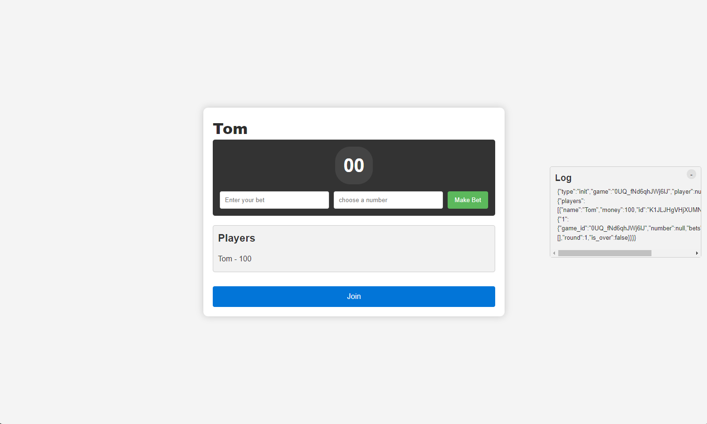

# WormsSockets 


A simple backend using sockets to play Worms Roullete with friends.
We use docker and docker-compose to run the server, so you need to have docker installed in your machine.
Using docker, we have 3 containers: web, mongodb and redis.

The main game is in the **/game** route, so you can access it in **http://localhost:8000/game**.

- [WormsSockets](#wormssockets)
- [Containers](#containers)
- [Installation](#installation)
- [Usage](#usage)
- [Testing](#testing)
- [Architecture](#architecture)
  - [Endpoints](#endpoints)


# Containers

We have 3 containers:
- **web**: The web server, which is a simple python server using sockets.
- **mongodb**: The database, which is a mongo database.
- **redis**: The cache, which is a redis database.

# Installation
First, create a .env file in the root folder with the following main  variables:
- MONGO_INITDB_ROOT_USERNAME=myuser
- MONGO_INITDB_ROOT_PASSWORD=mypass

and the ones in the [**Env Example**](./env.example) file.

To run the server, you need to have docker and docker-compose installed in your machine.
Then, you just need to run the following command:

```bash
make build
```

# Usage
To run the server, you just need to run the following command:

```bash
make up
```

The main game is in the **/game** route, so you can access it in **http://localhost:8000/game**.
I also included a ping chat on the **/chat** route, so you can access it in **http://localhost:8000/chat**.
The docs are in the **/docs** route, so you can access it in **http://localhost:8000/docs**.

If you want to enter a specific container run the following command with the appropriate container name and the application running:

```bash
make enter <container_name>
```

To stop the server, you just need to run the following command:

```bash
make down
```
or 
```bash
ctrl + c
```     

# Testing

I included a few tests to the server, so you can run them with the following commands:

```bash
make enter web

pytest
```

# Architecture

The main application logic is on the [**/app**](./app/) folder, which contains the main.py file, which is the main server file, and the [**/game**](./game) folder, which contains the game logic.

The [docker-compose.yml](./docker-compose.yml) file contains the docker-compose configuration for all the containers.

## Endpoints

All the endpoints are in the [**/app/routes**](./app/routes/) folder.
I tried to separate the endpoints by their functionality, so we have the following endpoints:

- **/game**: The main game endpoint, which contains the game logic.
- **/chat**: The ping chat endpoint, which contains the chat logic.
- **/docs**: The docs endpoint, which contains the swagger docs.

